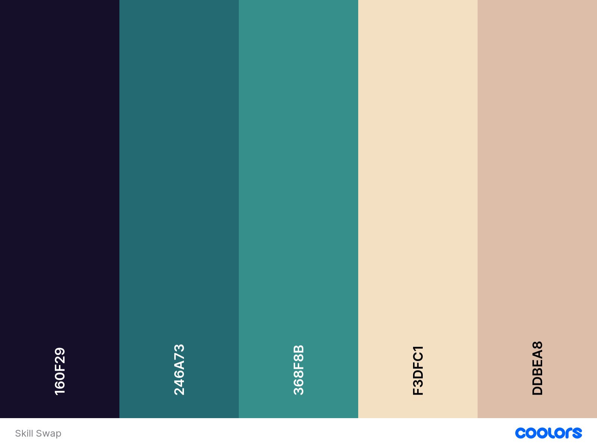

# Skill Share Website 

The Skill Share website is a responsive website, allowing users to visit on a range of mobile phone sizes, tables and desktops. The purpose is to find out information about the Skill Share service.

Skill Share is a service aimed at helping individuals who have gaps in their CV re-enter the workforce. The service allows career coaching, CV proofreading and speakers from different sectors. Individuals are paired with a mentor to guide them, and service users meet to 'skill share' . Common examples include a younger individual receiving training in Microsoft Excel from an experienced professional in return for training in social media management. 
Existing and potential users can view upcoming career events. These events are educational and aim to help individuals understand the job market and potentially new career paths.


[View the live project here.] ()


- - - 
## User Experience (UX)

#

### Purpose for the website

* A way to informing potential users of the service.
* A way for potential users to get an understanding of how the service works.
* Explaining how the service came to exist.
* The ability to view past and upcoming events.
* A way for people to locate the physical location of the service
* Providing methods of contact (social media and contact form).

 **User Stories**

#### Client Goals
* To have a responsive website 
- Viewed easily on mobile devices, tablets and laptops/desktops
- Responsive when changing the size of a browser window
* Fast loading website. 
* A clear outline of the service.
* A way to see upcoming events
* Provide plenty of opportunities to make contact through social media.
* A contact form.

#### First Time Visitor Goals
* I want to find out what the Skill Share service is
* I want to find out if this service is right for me.
* I want to be able to navigate the website easily and find the information quickly.
* I want to be be able to contact the service easily. 

#### Returning visitor
* I want to find up-to-date information about the service
* I want to be able to navigate the site easily
*I want to be able to connect with the service through social media

 
 - #### Frequent User Goals 

 ## Features

 

### Future Features

   *   ### Wireframes

    -   Home Page Wireframe - [View](https://github.com/)

    -   Mobile Wireframe - [View](https://github.com/)

    -   Contact Us Page Wireframe - [View](https://github.com/)


## Wireframes
#
## Technology 
#
## Testing 
#


## Design

### Colour Scheme.
The colour scheme used [Coolors] to generate a colour palette. 


### Typography
The website used [Font Joy](https://fontjoy.com/) to pair complimentary fonts to ensure headings were eye-catching and the body text was clear and easy to read. The three fonts are from [Google Fonts](https://fonts.google.com). The fonts are embedded using an @import url generated on the Google Fonts website.  Each font has a back-up in case the assigned font does not load.
```
font-family: 'Biryani', sans-serif;
font-family: 'Montserrat', sans-serif;
font-family: 'Raleway', sans-serif;
```
 Please see (#credits) for further information on individual font designers and licensing. 

### Imagery
Royalty free stock images were used for the hero image and for the photo gallery on the events page. I have credited the authors in the (#credits) section.

Wireframes were created for mobile, tablet and desktop
## Features

There are five pages in total. The interactive part of the website is comprised of three pages all of which are accessible from the navigation menu:

1.Home
2.Events
3.Contact.

There remaining pages are to acknowledge a user action.

4. Confirmation of subscribing to a newsletter
5. A thank you message when a user sends an enquiry using the contact form. 

* All Pages on the website have:
  * A header section which shows the 'Skill Share' title.
  * A responsive navigation bar. There are links to 'Home', 'Events', and 'Contact' pages.
  The navigation bar grows to fit different screen sizes, maintaining even spacing.  This prevents the screen being cluttered and provides a good user experience. This method is ideal for a navigation menu with only three links, .This  also allows an element of futureproofing, as the navigation bar will still look neat if another menu item is required. It can be adjusted with padding/margin without changing the layout of the page.
  * All pages pertaining to the website will not open a new browser window as per common practice. The user can navigate back to the website easily if referred to the acknowledgement/thank you pages.
* A footer which contains social media links to facebook, instagram and twitter. It also provides another link to the contact page. Social media links will open in a new browser window Font awesome icons were used to promote familiarity as they are instantly recognisable. It presents as uncluttered and tidy whilst still filling the space on larger screens.

### Testing

### Bugs

100 vh instead of 100% for navbar

Changed gradients for loading times


background images not loaded on cards on home. showed on gitpod but not on live site. 

modified navbar Ivy Walobwa https://blog.logrocket.com/create-responsive-mobile-menu-with-css-no-javascript/


navbar unresponsive when resizing window due to resetting styles  (html padding, margin: 0;

## Deployment

### Github Pages

The project was deployed to GitHub Pages using the following steps...

1. Log in to GitHub and locate the [GitHub Repository](https://github.com/)
2. At the top of the Repository (not top of page), locate the "Settings" Button on the menu.
    - Alternatively Click [Here](https://raw.githubusercontent.com/) for a GIF demonstrating the process starting from Step 2.
3. Scroll down the Settings page until you locate the "GitHub Pages" Section.
4. Under "Source", click the dropdown called "None" and select "Master Branch".
5. The page will automatically refresh.
6. Scroll back down through the page to locate the now published site [link](https://github.com) in the "GitHub Pages" section.

### Forking the GitHub Repository

By forking the GitHub Repository we make a copy of the original repository on our GitHub account to view and/or make changes without affecting the original repository by using the following steps...

1. Log in to GitHub and locate the [GitHub Repository](https://github.com/)
2. At the top of the Repository (not top of page) just above the "Settings" Button on the menu, locate the "Fork" Button.
3. You should now have a copy of the original repository in your GitHub account.

### Making a Local Clone

1. Log in to GitHub and locate the [GitHub Repository](https://github.com/)
2. Under the repository name, click "Clone or download".
3. To clone the repository using HTTPS, under "Clone with HTTPS", copy the link.
4. Open Git Bash
5. Change the current working directory to the location where you want the cloned directory to be made.
6. Type `git clone`, and then paste the URL you copied in Step 3.

```
$ git clone https://github.com/YOUR-USERNAME/YOUR-REPOSITORY
```

7. Press Enter. Your local clone will be created.

```
$ git clone https://github.com/YOUR-USERNAME/YOUR-REPOSITORY
> Cloning into `CI-Clone`...
> remote: Counting objects: 10, done.
> remote: Compressing objects: 100% (8/8), done.
> remove: Total 10 (delta 1), reused 10 (delta 1)
> Unpacking objects: 100% (10/10), done.
```

Click [Here](https://help.github.com/en/github/creating-cloning-and-archiving-repositories/cloning-a-repository#cloning-a-repository-to-github-desktop) to retrieve pictures for some of the buttons and more detailed explanations of the above process.

## Credits
### Google Fonts

*Google fonts are licensed under the [Open Font License][Open Font License].*

 **Raleway**
 - Initially designed by Matt McInerney, it was expanded into a 9 weight family by Pablo Impallari and Rodrigo Fuenzalida in 2012 and iKerned by Igino Marini. A thorough review and italic was added in 2016.  For more information click [here][Google Fonts Raleway Information].

**Montserrat**

- Designed by Julieta Ulanovsky, Sol Matas, Juan Pablo del Peral, Jacques Le Bailly. The Montserrat project is led by Julieta Ulanovsky, a type designer based in Buenos Aires, Argentina. For more information click [here][Google Fonts Montserrat Information].

**Biryani**
- Designed by Dan Reynolds and Mathieu Réguer. The Biryani project is led by Dan Reynolds, a type designer based in Berlin, Germany. For more information click [here][Google Fonts Biryani Information].


### Code

### Acknowledgements

-   Everyone at Student Care for their unwavering support through a difficult time. 

-   My mentor, Rohit for his valuable guidance and ability to inspire. 

-  My partner, who is helping me fund this course, supporting me through a challenging time and for believing in my abilities.

 - In honor of my late mother, who would have been thrilled to know I was on this course. 


[Open Font License]: https://scripts.sil.org/cms/scripts/page.php?site_id=nrsi&id=OFL
[Google Fonts Raleway Information]: https://fonts.google.com/specimen/Raleway/about?query=raleway
[Google Fonts Montserrat Information]: https://fonts.google.com/specimen/Montserrat/about
[Google Fonts Biryani Information]: https://fonts.google.com/specimen/Biryani/about?query=biry
[Coolors-palette]: https://coolors.co/
